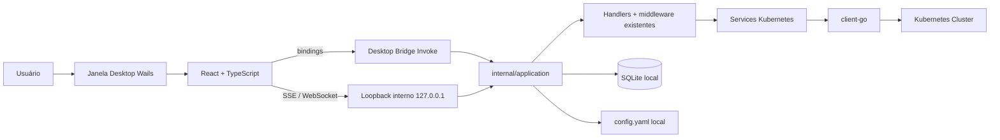

# Arquitetura Desktop (Wails) do KubePeep

> **Status:** implementação inicial — validação nativa pendente nas plataformas de release.
>
> **Versão escolhida:** Wails **v2.15.0** (estável). Wails v3 continua em beta e foi descartado. Compatibilidade validada: Go do projeto é 1.26.7 (módulo Wails exige ≥ 1.25), Node 24/npm 11, React 19 + Vite 8.

## 1. Arquitetura antes

```text
cmd/kubePeep → internal/cli (Cobra)
    → internal/runtime (lock, listener loopback, instance.json, canal de controle)
    → internal/cli.productionFactory.Build (composição ad hoc)
    → internal/app (Ginger + handlers + SPA embutida)
```

Um único modo de execução: servidor HTTP em `127.0.0.1` + abertura de navegador externo. O frontend React (Vite) é embutido em `internal/web/dist` e fala com o backend por `fetch` relativo (JSON + SSE + WebSocket de exec).

## 2. Arquitetura depois

```text
cmd/kubePeep (web)                    main.go raiz (desktop, tag `desktop`)
        │                                      │
        └────────────── internal/cli (Cobra) ──┘
                              │
              root `kubepeep` → desktop · `serve` → web
                              │
              internal/application (composição única do core)
                              │
      ┌───────────────────────┼──────────────────────────┐
      ▼                       ▼                          ▼
internal/runtime      internal/desktop (bridge)   internal/desktop/wails
(web: lock+HTTP)      (Invoke/loopback, sem      (janela, AssetServer,
                      dependência de Wails)      glue Wails v2, tag desktop)
```



## 3. Responsabilidades das camadas

| Camada | Responsabilidade | Depende de Wails? |
| --- | --- | --- |
| `internal/application` | Composição única de logger, SQLite, kuberuntime, authorization, services, selection, health e aplicação HTTP. Reusada por web, desktop e testes. | Não |
| `internal/desktop` | `Bridge` (binding genérico com allowlist), `Loopback` interno com CORS restrito, helpers de origins/hosts do WebView. | Não |
| `internal/desktop/runner` | Seleciona a implementação desktop por build tag (`desktop`). | Indiretamente (tag) |
| `internal/desktop/wails` | Glue Wails v2: janela, AssetServer (SPA + fallback), single-instance, ícone, cleanup. | Sim (compilado só com tag `desktop`) |
| `internal/cli` | Superfície Cobra: raiz = desktop (em builds com tag), `serve` = web, demais comandos intactos. | Não |
| `web/` | Frontend React existente; `web/src/api/desktop.ts` roteia JSON por bindings e streams pelo loopback. | Não (detecta `window.go` em runtime) |

## 4. Fluxo de inicialização (desktop)

1. `kubepeep` (binário com tag `desktop`) → Cobra → `desktop/runner.Run`.
2. Adquire listener loopback interno (`BindLoopback`; porta do `config.yaml` ou intervalo padrão 2748–2797).
3. `application.Compose` com o perfil de segurança desktop (`ExtraHosts`/`ExtraOrigins`).
4. `desktop.NewLoopback` serve o handler do core somente para streams (SSE/WS) com CORS restrito às origins do WebView.
5. `wails.Run`: janela "KubePeep" (1360×860, mín. 1024×640, redimensionável), SPA embutida via AssetServer, `Bridge` exposto como binding, single-instance, ícone, tema do sistema.
6. Fechar a janela → `OnShutdown` → cleanup LIFO (watches, actions, clients, log, SQLite, loopback).

## 5. Fluxo React ↔ Wails ↔ Go ↔ Kubernetes

- **JSON** (`/api/v1/*`): `client.ts` detecta `window.go.desktop.Bridge` e chama `Invoke(method, path, headers, body)`. O bridge reconstrói um `http.Request` sintético (Host/Origin canônicos, headers com allowlist — CSRF, Idempotency-Key, Content-Type) e executa o handler **in-process**, sem porta. Toda validação, paginação, autorização e serialização permanecem nos handlers existentes.
- **SSE** (`/api/v1/stream`, `/logs/stream`) e **WebSocket** (exec): usam `streamBase` (loopback interno) porque o AssetServer do Wails não implementa `http.Flusher` nem WebSocket (verificado no código-fonte v2.15.0). O frontend apenas prefixa a URL com `streamBase` em modo desktop.
- **Segurança**: CSRF e geração continuam obrigatórios; origins extras só existem em builds desktop e nunca no modo web. Credenciais do kubeconfig nunca atravessam bindings nem frontend.

## 6. Decisões técnicas

1. **Wails v2.15.0 estável**; v3 (beta) rejeitado.
2. **Binding genérico com allowlist** (`Invoke`) em vez de um método por endpoint: evita duplicar regras de negócio; a tradução HTTP/erro/paginação fica nos handlers. Caminhos de stream/exec são proibidos via binding.
3. **Loopback interno só para streams/exec**, justificado: SSE exige `Flusher` e exec exige `Hijacker`/WebSocket — não suportados pelo AssetServer do Wails. O listener nunca sai de `127.0.0.1`.
4. **Wails fora do core**: `internal/application`, `internal/desktop` e `internal/cli` não importam Wails; o glue fica em `internal/desktop/wails` sob build tag `desktop`. `go build ./...`/CI sem tag não compilam nem vinculam Wails.
5. **Modo web preservado** (`kubepeep serve`): a composição única (`internal/application`) elimina duplicação; o comportamento web não muda.
6. **Perfil de segurança desktop mínimo**: `ExtraHosts` (`wails`, `wails.localhost`) e `ExtraOrigins` (`null`, `wails://wails`, `http(s)://wails.localhost`) aplicados somente quando o desktop está ativo; CORS refletido apenas nas rotas `/stream` do loopback interno.

## 7. Riscos e limitações

- **Build nativo Linux** exige `libgtk-3-dev` e `libwebkit2gtk-4.0-dev`; macOS exige Xcode CLT; Windows exige WebView2 (sem CGO). Nesta máquina de desenvolvimento as dependências do Linux estão ausentes, então o binário desktop ainda não foi compilado/executado localmente — pendência conhecida.
- **Streams em WebView**: dependem do suporte a `text/event-stream` do WebKit/WebView2; se algum sistema operacional não expuser o stream incremental, a tela indica indisponibilidade e mantém o refresh manual (fallback já existente).
- **AbortSignal**: chamadas por binding não abortam a transferência (a geração do TanStack Query continua cancelando consultas obsoletas no lado do cliente).
- **GoReleaser**: não gera binários desktop automaticamente; os builds Wails são nativos por OS e devem ser produzidos nos runners nativos do workflow de release (integração a ser automatizada no CI).
- **CSP**: a página desktop é servida pelo AssetServer; os cabeçalhos CSP próprios do modo web não se aplicam dentro do WebView.

## 8. Estratégia de evolução

1. Automatizar os builds Wails nativos por OS no workflow de release (Linux/macOS/Windows já existem como runners nativos).
2. Substituir o handcraft `web/src/wailsjs` pela geração oficial quando houver um package `main` na raiz sem build tag (`wails generate module`).
3. Migrar exec e streams para eventos Wails puros quando a plataforma oferecer suporte equivalente, eliminando o loopback.
4. Persistir tamanho/posição da janela nas preferências locais quando o schema de preferências ganhar uma seção de janela.
