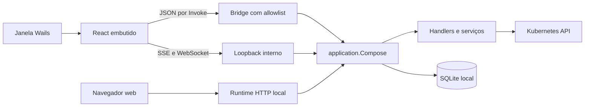

# Arquitetura desktop

O desktop é implementado com Wails v2.15.0, versão fixada em `go.mod`.
Compartilha o core do modo web. A validação da distribuição em cada sistema
operacional pertence aos gates nativos de release.

## Composição

| Camada | Responsabilidade |
| --- | --- |
| `main.go`, `cmd/kubePeep/` | Entrypoints selecionados pelo build |
| `internal/cli` | Comandos Cobra; raiz desktop em build com tag e `serve` web |
| `internal/application` | Composição comum de logger, SQLite, seleção, autorização e serviços |
| `internal/desktop` | Bridge genérica, allowlists, transporte e listener de streams |
| `internal/desktop/runner` | Escolha da implementação por build tag |
| `internal/desktop/wails` | Janela, AssetServer, single-instance e cleanup; depende de Wails |
| `web/src/api/desktop.ts` | Roteamento de chamadas JSON e URLs de streaming no frontend |

## Inicialização e encerramento

1. A CLI seleciona o runner desktop quando o binário possui a tag `desktop`.
2. O runner adquire um listener em `127.0.0.1` e compõe o core com o perfil
   de segurança do WebView.
3. A janela carrega a SPA embutida pelo AssetServer; a bridge fica disponível
   por binding. O listener interno atende apenas os transportes de streaming.
4. Fechar a janela aciona cleanup do core e do listener; mudança de seleção
   também invalida consultas, watches e sessões vinculadas à geração antiga.

`serve` usa o runtime web. `status` e `stop` controlam sua instância pelo
protocolo autenticado de [lifecycle web](architecture.md#7-contrato-operacional-cli).
A janela desktop possui ciclo de vida próprio.

## Transportes

**JSON:** `client.ts` detecta `window.go.desktop.Bridge` e chama
`Invoke(method, path, headers, body)`. A bridge reconstrói uma requisição
sintética com Host/Origin canônicos e headers allowlisted. Os mesmos handlers
aplicam CSRF, geração, autorização, validação, paginação e serialização.
Chamadas JSON não passam pelo listener de streams.

**SSE e exec WebSocket:** usam o loopback interno. O AssetServer do Wails
não fornece as capacidades de transporte exigidas por esses caminhos.
A bridge rejeita caminhos de stream/exec; o frontend prefixa as URLs de
stream com a origem local apropriada.

**Segurança:** origins adicionais do WebView são restritas ao perfil desktop;
o modo web não as aceita. O listener nunca sai de `127.0.0.1`. Credenciais
Kubernetes não atravessam bindings. As regras completas estão em
[security.md](security.md) e os envelopes em [api.md](api.md).

## Limitações e manutenção

- Linux vincula bibliotecas GTK/WebKit nativas; veja [desktop-build.md](desktop-build.md).
- Cancelar uma query não interrompe necessariamente uma chamada de binding
  já em transferência; a geração continua impedindo a aplicação de resposta
  obsoleta na interface.
- Streaming depende do WebView; indisponibilidade deve manter estados claros
  e o caminho de refresh manual.
- A página é servida pelo AssetServer; cabeçalhos CSP do servidor web não
  representam automaticamente uma política aplicada dentro do WebView.
- Bindings próprios são preservados por `-skipbindings` nos builds. Uma
  regeneração deve revisar o contrato e os testes de transporte.

Os builds nativos e pacotes já estão definidos no workflow de release.
Persistência de preferências adicionais da janela e evolução da interface
seguem o [plano v1](../plan/README.md), sem duplicar um backlog neste documento.
